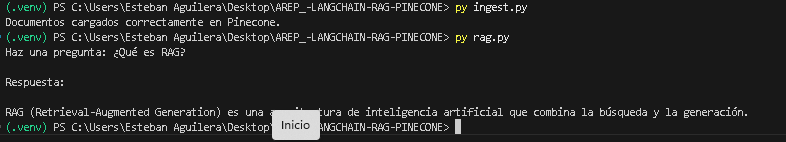

# RAG con LangChain + Pinecone + Groq

## Introducción

En esta segunda parte del laboratorio implementé un sistema básico de Retrieval-Augmented Generation (RAG) usando LangChain, Pinecone y un modelo LLM vía Groq.

La idea fue entender, de forma práctica y paso a paso, cómo conectar:

- Un modelo de embeddings.
- Una base de datos vectorial.
- Un modelo generativo.
- Un flujo completo de recuperación y generación.

Me enfoqué en comprender qué ocurre en cada etapa: cómo se generan los embeddings, cómo se almacenan en Pinecone y cómo el modelo utiliza el contexto recuperado para producir la respuesta final.

---

## Arquitectura general

El sistema está dividido en dos partes principales: ingestión y consulta.

### 1. Ingesta (`ingest.py`)

En esta fase:

1. Se carga un archivo de texto (`data.txt`) que contiene la base de conocimiento.
2. El texto se divide en fragmentos (chunks) usando un separador recursivo.
3. Cada fragmento se transforma en un embedding utilizando el modelo `sentence-transformers/all-MiniLM-L6-v2`.
4. Los embeddings se almacenan en un índice de Pinecone llamado `rag-index`.

Con esto se construye la base vectorial sobre la cual se realizarán las búsquedas semánticas.

---

### 2. Consulta (`rag.py`)

En esta fase:

1. El usuario ingresa una pregunta por consola.
2. El retriever consulta Pinecone y obtiene los fragmentos más relevantes.
3. Se construye un contexto concatenando los fragmentos recuperados.
4. El modelo LLM (llama-3.1-8b-instant vía Groq) genera la respuesta usando únicamente ese contexto.

Este flujo completo corresponde al patrón RAG: primero recuperación, luego generación.

---

## Contenido del archivo `data.txt`

Para las pruebas se utilizó el siguiente contenido base:

- Definición de Retrieval-Augmented Generation (RAG).
- Explicación del componente de retrieval.
- Explicación del componente de generation.
- Definición de Pinecone como base de datos vectorial.
- Definición de embeddings y su función semántica.

---

## Ejecución del sistema

Primero se ejecuta la ingesta:

```bash
py ingest.py
```

Salida esperada:

```
Documentos cargados correctamente en Pinecone.
```

Luego se ejecuta la consulta:

```bash
py rag.py
```

Ejemplo de pregunta:

```
¿Qué es RAG?
```

Ejemplo de respuesta generada:

```
RAG (Retrieval-Augmented Generation) es una arquitectura de inteligencia artificial que combina la búsqueda y la generación.
```

---

## Evidencia de ejecución

A continuación se deja espacio para incluir la captura de pantalla donde se muestra la ejecución correcta del sistema:



Reemplazar la ruta anterior por la ubicación real de la imagen en el repositorio.

---

## Validación del comportamiento

Se realizaron dos tipos de pruebas:

1. Preguntas cuya respuesta estaba explícitamente en `data.txt`.  
   El sistema respondió correctamente usando la información recuperada.

2. Preguntas cuya respuesta no estaba en el archivo.  
   El sistema no introdujo información externa, lo cual indica que la respuesta depende del contexto recuperado y no solo del conocimiento general del modelo.

Esto confirma que el flujo de recuperación está funcionando adecuadamente.

---

## Decisiones técnicas

- Embeddings: `sentence-transformers/all-MiniLM-L6-v2` (384 dimensiones).
- Base vectorial: Pinecone (modo serverless, métrica cosine).
- LLM: `llama-3.1-8b-instant` vía Groq.
- División de texto: chunks de 500 caracteres con 50 de solapamiento.
- Entorno: Python 3.11 para asegurar compatibilidad con dependencias.

---

## Conclusión

Con esta implementación logré construir un pipeline RAG completo desde cero:

- Ingestión de documentos.
- Generación de embeddings.
- Almacenamiento vectorial.
- Recuperación semántica.
- Generación condicionada al contexto.

Este laboratorio permitió pasar de la explicación teórica de RAG a una implementación funcional utilizando herramientas actuales del ecosistema de IA.

---

## Información del Proyecto

- Autor: Esteban Aguilera Contreras
- Universidad: Escuela Colombiana de Ingeniería Julio Garavito
- Asignatura: Arquitecturas Empresariales (AREP)